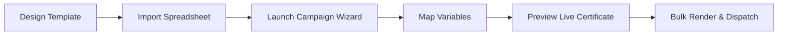

# 🎓 CertiMail — Automated Certificate Studio & Bulk Email Dispatcher

> **Design, generate, personalize, and bulk-dispatch high-fidelity certificates in seconds.**

[](https://nextjs.org/)
[](https://react.dev/)
[](https://www.typescriptlang.org/)
[](https://tailwindcss.com/)
[](https://fabricjs.com/)
[](https://parall.ax/products/jspdf)

---

## 🌟 Overview

**CertiMail** is a modern, full-featured web platform engineered for event organizers, educators, corporate trainers, and hackathon hosts. It bridges the gap between certificate graphic design, spreadsheet participant management, high-resolution rendering, and automated SMTP email delivery with individual attachments.

With CertiMail, you no longer need complex mail merges, graphic software export loops, or manual email sending. Everything runs seamlessly in a unified, beautifully crafted web interface.

---

## ✨ Key Features

### 🎨 1. Visual Drag-and-Drop Certificate Studio
- **Powered by Fabric.js v7**: High-performance interactive HTML5 canvas engine.
- **Document Size Presets**: Standard dimensions including **A4 Landscape** (3508×2480 @ 300 DPI), **A4 Portrait**, **US Letter**, **Full HD (1080p)**, **4K Ultra HD**, **Square (1:1)**, and customizable dimensions.
- **Dynamic Variable Tags**: Insert dynamic tokens like `{{name}}`, `{{event}}`, `{{date}}`, `{{position}}`, `{{certificate_id}}`, and custom fields that auto-populate per recipient.
- **Typography & Styling**: Deep typography customization with curated Google Fonts, font size, weight, line-height, letter-spacing, alignment, and fill colors.
- **Graphic Elements & Assets**: Add decorative rectangles, circles, divider lines, custom badges, watermark logos, and signatures.
- **Layer & Alignment Controls**: Bring to front, send backward, align elements horizontally/vertically, toggle aspect ratio lock, and precision coordinates.
- **Undo / Redo & Autosave**: Full canvas history stack with autosave to local persistence.
- **Live In-Canvas Preview**: Toggle preview mode to inspect real-time variable substitution before exporting.

### 📊 2. Smart Spreadsheet & Recipient Management
- **Universal Spreadsheet Import**: Drag and drop `.xlsx`, `.xls`, or `.csv` files parsed instantaneously client-side using SheetJS (`xlsx`).
- **Auto-Suggest Column Mapping**: Intelligent header matching that maps spreadsheet columns (`Attendee`, `Email Address`, `Course Title`, `Award Date`) to template variables.
- **Data Validation & Hygiene**: Built-in validation catching invalid email formats, duplicate email entries, and missing required attributes.
- **Participant Directory**: Search, filter, edit, delete, or manually add recipients with one click.

### 🚀 3. Multi-Step Campaign Wizard
- **Guided 6-Step Workflow**:
  1. **Campaign Details**: Name and describe the campaign run.
  2. **Select Template**: Pick from saved certificate designs.
  3. **Select Recipients**: Choose all or subset of participants.
  4. **Variable Mapping**: Verify placeholder-to-column bindings.
  5. **Live Merged Preview**: Preview rendered certificates for any individual recipient.
  6. **Email Composer & Dispatch**: Compose personalized email subject lines and HTML bodies with dynamic tags, review attachments, and initiate delivery.
- **Real-Time Progress Tracking**: Non-blocking asynchronous processing with real-time progress indicators, success counts, and error logging.

### 📧 4. Native SMTP Engine & Email Delivery
- **Custom SMTP Support**: Seamlessly connect Gmail, Outlook/Office 365, Amazon SES, SendGrid, Mailgun, or self-hosted SMTP relays.
- **Credential Health Check**: Integrated `/api/smtp/test` endpoint to verify connection and handshake before launching campaigns.
- **Direct Certificate Attachment**: Automatically attaches generated personalized certificates as high-res PNG or vector PDF directly to outgoing emails.
- **Custom Sender Identity**: Configure custom `From Name` and `From Email` addresses.

### 🛡️ 5. Certificate Verification Portal
- **Public Verification Route**: Accessible verification portal at `/verify` and `/verify/[id]`.
- **Authenticity Confirmation**: Verify certificate validity, recipient details, issuer information, and issuance date via verification codes.

### 📄 6. High-Fidelity PDF & PNG Export
- **1:1 Native Resolution**: Export pixel-perfect certificates at up to 300 DPI print-ready clarity.
- **Vector-Dimensioned PDFs**: Uses `jsPDF` for crisp, scalable document output.
- **Single & Batch Downloads**: Download individual certificates or download entire campaign archives directly from the dashboard.

---

## 🛠️ Tech Stack

| Technology | Purpose |
|---|---|
| **[Next.js 16](https://nextjs.org/)** | React Framework (App Router, Server Components & Route Handlers) |
| **[React 19](https://react.dev/)** | Modern Component Architecture & React Compiler |
| **[TypeScript](https://www.typescriptlang.org/)** | Strict type safety and maintainable codebase |
| **[Tailwind CSS v4](https://tailwindcss.com/)** | Next-generation utility-first styling with modern dark theme |
| **[Fabric.js v7](https://fabricjs.com/)** | Interactive Canvas engine for certificate template editing |
| **[jsPDF](https://parall.ax/products/jspdf)** | Client-side vector PDF document generation |
| **[SheetJS (XLSX)](https://sheetjs.com/)** | Robust Excel & CSV parsing engine |
| **[Nodemailer](https://nodemailer.com/)** | Server-side SMTP client and email transport |
| **[Lucide React](https://lucide.dev/)** | Clean, accessible iconography |

---

## 📁 Project Structure

```
Certificate generator/
├── public/                     # Static public assets
├── src/
│   ├── app/                    # Next.js App Router
│   │   ├── api/                # Backend API routes
│   │   │   └── smtp/
│   │   │       ├── send/       # POST: Dispatches personalized email with attachment
│   │   │       └── test/       # POST: Tests SMTP server handshake
│   │   ├── campaigns/          # Campaign dashboard, list, and creation wizard
│   │   │   ├── [id]/           # Detailed campaign status & report
│   │   │   └── new/            # 6-step campaign creation wizard
│   │   ├── certificates/       # Generated certificates repository & download hub
│   │   ├── dashboard/          # Analytics overview & quick actions
│   │   ├── recipients/         # Participant directory & spreadsheet importer
│   │   ├── settings/           # SMTP credentials configuration & test sender
│   │   ├── templates/          # Template manager & certificate studio
│   │   │   └── new/            # Canvas editor studio route
│   │   ├── verify/             # Public certificate validation portal
│   │   │   └── [id]/           # Certificate verification result view
│   │   ├── globals.css         # Global styles & design system tokens
│   │   ├── layout.tsx          # Root layout with font configuration
│   │   └── page.tsx            # Root redirect to /dashboard
│   ├── components/
│   │   ├── dashboard/          # Stat cards, recent campaigns, metrics
│   │   ├── editor/             # Fabric.js certificate canvas & toolbars
│   │   │   ├── properties/     # Text, shape, image, alignment property panels
│   │   │   ├── certificate-editor.tsx
│   │   │   ├── editor-topbar.tsx
│   │   │   ├── editor-sidebar-left.tsx
│   │   │   ├── editor-sidebar-right.tsx
│   │   │   ├── editor-preview-modal.tsx
│   │   │   └── editor-utils.ts
│   │   ├── layout/             # App shell, navigation sidebar & header
│   │   └── ui/                 # Base UI and Shadcn components
│   ├── lib/
│   │   ├── certificate-engine.ts  # Canvas rendering, variable replacement, PDF export
│   │   ├── spreadsheet-parser.ts  # XLSX/CSV parsing, column mapping & validation
│   │   └── utils.ts               # General utility helpers
│   └── types/
│       └── index.ts            # Core TypeScript interfaces & definitions
├── components.json             # Shadcn UI configuration
├── next.config.ts              # Next.js configuration
├── package.json                # Project dependencies and npm scripts
├── tsconfig.json               # TypeScript configuration
└── README.md                   # Project documentation
```

---

## 🚀 Getting Started

### Prerequisites

Ensure you have the following installed on your development machine:
- **Node.js**: `v18.17.0` or higher (Node.js 20+ recommended)
- **npm**, **yarn**, **pnpm**, or **bun**

### Installation

1. **Clone the repository**:
   ```bash
   git clone https://github.com/your-username/certimail.git
   cd certimail
   ```

2. **Install dependencies**:
   ```bash
   npm install
   # or
   yarn install
   # or
   pnpm install
   ```

3. **Start the local development server**:
   ```bash
   npm run dev
   ```

4. **Access the application**:
   Open [http://localhost:3000](http://localhost:3000) in your web browser. You will be directed straight to the **Dashboard**.

---

## ⚙️ SMTP Setup Guide

To enable automated bulk certificate email delivery:

1. Navigate to **Settings > SMTP Settings** (`/settings/smtp`).
2. Fill in your SMTP provider details:
   - **SMTP Host**: e.g., `smtp.gmail.com` or `smtp.sendgrid.net`
   - **Port**: `587` (STARTTLS) or `465` (SSL)
   - **Use SSL/TLS**: Toggle on if using port `465`
   - **Username**: Your SMTP username or email
   - **Password / App Password**: Your SMTP password or App-specific password
   - **Sender Name**: e.g., `CertiMail Team`
   - **Sender Email**: e.g., `certificates@yourdomain.com`
3. Click **"Test Connection"** to verify server connectivity.
4. Optionally dispatch a test email to your personal address to verify inbox placement.
5. Click **"Save Configuration"**.

> [!TIP]
> If you are using **Gmail**, enable 2-Step Verification on your Google Account and generate an **App Password** under *Security > 2-Step Verification > App Passwords*. Use that 16-character token as your password.

---

## 📖 How to Run a Campaign (Step-by-Step)



1. **Design a Certificate Template** (`/templates/new`):
   - Choose a paper size preset (e.g. A4 Landscape).
   - Add text blocks with variables like `{{name}}` and `{{event}}`.
   - Add background colors, frames, logos, and signatures.
   - Save your template.

2. **Import Participants** (`/recipients`):
   - Upload an `.xlsx` or `.csv` spreadsheet with columns like `Name`, `Email`, `Course`, `Date`.
   - The smart parser automatically verifies email validity and flags duplicate records.

3. **Create a Campaign** (`/campaigns/new`):
   - Select your saved template and recipient list.
   - Verify column mappings.
   - Preview individual rendered certificates with real participant names.
   - Customize your email subject and body template.
   - Click **"Launch Campaign"** to automatically generate certificates and dispatch emails!

4. **Verify Issued Certificates** (`/verify`):
   - Anyone can enter the unique certificate ID at `/verify` to validate issuance date, recipient details, and authenticity.

---

## 📜 Available Scripts

- `npm run dev` — Starts the Next.js development server on port 3000.
- `npm run build` — Compiles and creates an optimized production build.
- `npm run start` — Runs the production server.
- `npm run lint` — Runs ESLint checks across the codebase.

---

## 📄 License

This project is licensed under the [MIT License](LICENSE).
